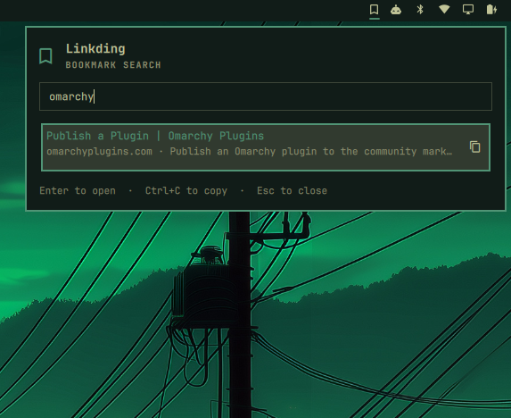

# Linkding bookmark picker for Omarchy Quattro

Search active and archived Linkding bookmarks from the Omarchy bar. Select a result to open it in the configured default browser, or copy its URL to the Wayland clipboard.



## Compatibility and permissions

This plugin targets Omarchy Quattro with plugin schema 1. It is not tested or advertised as compatible with legacy Omarchy shells.

Plugins run unsandboxed inside the user's long-running Omarchy shell. This plugin can execute user-level processes, contact the configured Linkding server, launch the default browser, write the clipboard, and read and write its protected configuration file. Inspect the source before enabling it.

The host provides these runtime tools. The plugin does not install them:

- Omarchy Quattro and Quickshell
- Python 3 and standard shell utilities
- `curl`
- `wl-copy`
- `omarchy-launch-browser`

## Install and configure

Install the plugin from its public repository:

```sh
omarchy plugin add https://github.com/rafaelvzago/omarchy-linkding-plugin.git
omarchy plugin inspect io.github.rafaelvzago.linkding
omarchy plugin enable io.github.rafaelvzago.linkding
```

Configure the Linkding connection from a terminal. The setup helper prompts for the token without echoing it, validates the token against `/api/user/profile/`, and saves the configuration atomically at `${XDG_CONFIG_HOME:-$HOME/.config}/linkding-search-plugin/config.json`.

```sh
~/.config/omarchy/plugins/io.github.rafaelvzago.linkding/linkding-setup
```

The configuration directory is mode `0700` and the file is mode `0600`. If you edit the file manually, preserve the JSON fields `baseUrl` and `apiToken` and these permissions. The token is never passed as a QML argument, put in a URL, shown in a notification, or written to logs.

## Use the picker

Open the Linkding panel from the bar or its configured hotkey. Type to search. The panel searches active and archived bookmarks and loads more results when you reach the end of the list.

- Click a result to open its URL in the default browser.
- Click the copy button on a result to copy its URL.
- Use Up and Down to select a result, then press Enter to open it.
- Press Ctrl+C to copy the selected URL.
- Press Escape to close the panel.
- Press Tab, or Shift+Tab, to switch between bar panels.

## Manual install and lifecycle

For a manual install, copy this directory to `~/.config/omarchy/plugins/io.github.rafaelvzago.linkding/`, rescan the shell, and enable the plugin. Exact command names can vary with the installed Quattro release. Run `omarchy plugin --help` for the commands supported by your installation.

```sh
omarchy plugin list --json
omarchy plugin inspect io.github.rafaelvzago.linkding
omarchy plugin validate ~/.config/omarchy/plugins/io.github.rafaelvzago.linkding
omarchy-shell shell rescanPlugins
omarchy bar move io.github.rafaelvzago.linkding --section left   # or center/right
omarchy plugin update io.github.rafaelvzago.linkding
omarchy plugin disable io.github.rafaelvzago.linkding
omarchy plugin remove io.github.rafaelvzago.linkding
```

The plugin does not start a second Quickshell process and has no automatic install or secret-store lifecycle hooks. Setup is explicit and user-owned. Disabling or removing the plugin does not manage the separate Linkding configuration file.

## Troubleshooting

If the bar reports missing or unsafe configuration, rerun `linkding-setup` and check the directory and file modes. The helper reports these connection states separately: `authentication-failed`, `unreachable`, `timeout`, `rate-limited`, `server-failed`, and `invalid-response`.

The bar health color checks unauthenticated `/health`; it never sends the API token. To inspect shell errors, run:

```sh
qs log -p "$OMARCHY_PATH/shell" --tail 100
```

## Local validation

Run these checks from the repository root:

```sh
python3 -m unittest discover -s tests -v
qmllint -I /usr/share/omarchy/shell BarWidget.qml Panel.qml
python3 -m json.tool manifest.json >/dev/null
python3 -m py_compile linkding_helper.py
omarchy plugin validate .
```

## Maintainers

Before submitting this plugin to the marketplace:

- Keep the code in a public GitHub repository.
- Keep a valid `manifest.json` at the repository root.
- Keep `README.md` and the MIT `LICENSE` at the repository root.
- Check that installation and removal are safe and do not require automatic secret-store lifecycle hooks.
- Run the local validation commands above, including `omarchy plugin validate .`.
- Submit the repository through the [Omarchy plugin issue form](https://github.com/HANCORE-linux/omarchy-plugin-marketplace/issues/new?template=submit-plugin.yml).
- Use `Productivity` as the suggested category.
- Use these suggested tags: `Linkding`, `bookmarks`, `search`, `bar-widget`.

The marketplace validates listings, not plugin security. Review the code and document any permissions before submitting.
